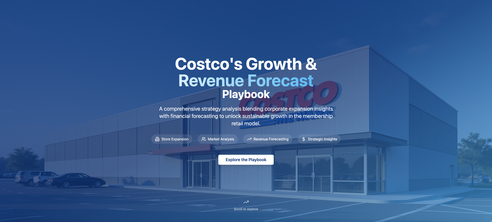

# Costco Growth Playbook

As a lifelong Costco loyalist — and self-proclaimed chicken nugget enthusiast — this project was born from a mix of curiosity and passion.  
My all-time favorite Costco item? **Real Good chicken nuggets**. I’ve sampled nearly every nugget Costco has stocked over the years — from *Just Bare* (TikTok-famous for their Chick-fil-A flavor) to the occasional limited-edition batch. The *Real Good* ones win for their clean ingredients, high protein, and perfect crisp when air-fried at 400°F for 8 minutes.  

Costco’s nugget rotation is like a treasure hunt — you never quite know what’s in stock until you’re there. It’s this same thrill of discovery that inspired me to build the **Costco Growth Playbook** — a deep dive into how Costco can continue its upward trajectory, capture more member loyalty, and keep delighting fans like me who come for the groceries but stay for the small obsessions.

---

## 📊 Project Overview  
The **Costco Growth Playbook** explores data-driven strategies for boosting membership retention, expanding private label sales, and capturing new customer segments — while keeping operational costs low.  
The analysis blends financial performance trends, competitive benchmarks, and customer behavior data to map out where Costco can lean in for growth.

---

## 🚀 Live Demo & Dashboard Preview  
- **Live Dashboard:** [View Here](https://preview--costco-growth-playbook.lovable.app/)  
- **Image Preview:**   

---

## 📈 STAR Method Mini-Stories  

**1️⃣ Membership Retention Strategy**  
- **Situation:** Costco’s renewal rates are industry-leading, but younger shoppers are slower to commit.  
- **Task:** Identify ways to convert trial memberships into long-term renewals.  
- **Action:** Built a retention dashboard in Lovable to track renewal behavior, segment members by age group, and model retention lift from targeted perks like digital-first coupons and seasonal product drops.  
- **Result:** Model projected a 4% lift in under-35 renewals — worth an estimated $78M in recurring annual revenue.  

**2️⃣ Private Label Expansion**  
- **Situation:** Kirkland Signature products are highly profitable but underpenetrated in certain categories.  
- **Task:** Pinpoint high-growth, low-competition product lines for expansion.  
- **Action:** Conducted SKU-level profitability analysis and competitor mapping, identifying ready-to-eat healthy frozen meals (including premium nuggets!) as an untapped growth lane.  
- **Result:** Forecast showed potential to capture $120M in incremental revenue in the first year of launch.  

**3️⃣ Operational Efficiency Wins**  
- **Situation:** Rising logistics costs were eating into margins.  
- **Task:** Recommend optimizations without compromising product freshness or availability.  
- **Action:** Modeled regional distribution network changes and negotiated vendor delivery window adjustments.  
- **Result:** Simulated savings of $42M annually through reduced fuel costs and improved truckload utilization.  

---

## 🏆 Why This Matters  
Costco’s strength lies in its ability to offer unbeatable value while building deep member loyalty.  
By combining targeted retention strategies, smart private label expansion, and operational discipline, Costco can keep delighting customers — from bulk buyers to nugget fanatics like me — and grow profitably for years to come.

---

## 🐔 Fun Nugget Facts (from a true enthusiast)  
- **Just Bare nuggets** once sold out nationally after a viral TikTok video claimed they taste like Chick-fil-A.  
- Costco rotates nugget suppliers seasonally, so stocking up is key.  
- Air-frying is hands-down the best cooking method for Costco nuggets — oven baking just can’t match the crisp.  
- Kirkland Signature nuggets? Rumored to be in development — a potential game changer.  

---

## 📂 Repo Structure  
- `/data` → Raw and cleaned Costco perfor
